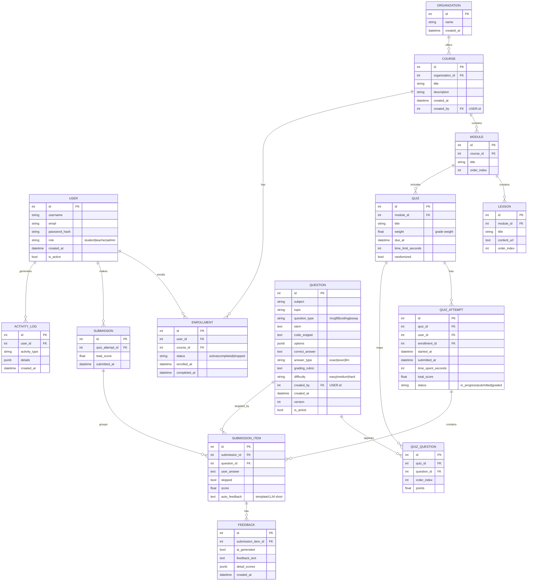

## LMS 핵심 ERD 초안 (Mermaid)

설명
- 핵심 흐름: USER가 COURSE에 ENROLLMENT → MODULE/QUIZ 진행 → QUIZ_ATTEMPT 생성 → SUBMISSION/SUBMISSION_ITEM 저장 → FEEDBACK 생성.
- 문제은행은 `QUESTION` 단일 테이블 + 버전 필드로 관리(간단화). 버전 세분화가 필요하면 별도 `QUESTION_VERSION` 테이블 분리 가능.
- 성적 집계는 `QUIZ_ATTEMPT.total_score` 기준, COURSE 레벨 집계는 뷰/머티리얼라이즈드 뷰로 확장 가능.

